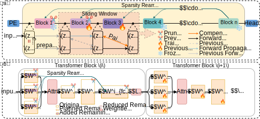

# ICP: Immediate Compensation Pruning for Mid-to-High Sparsity
[](#)

Official implementation for the paper **“ICP: Immediate Compensation Pruning for Mid‑to‑High Sparsity.”**
<!-- ([arXiv link ― coming soon](#)) -->

> *Xin Luo, Xueming Fu, Zihang Jiang, S. Kevin Zhou*
> University of Science and Technology of China, MIRACLE Center & CAS ICT

---

## 📝 Overview
<div align="center">
  
  <br/>
  <em>Figure 1. ICP pipeline: a two‑block sliding window alternates <strong>prune → compensate</strong>; sparsity is rearranged across blocks (α) and within a block (β).</em>
</div>
ICP strikes a middle ground between costly iterative pruning and purely one‑shot pruning by compensating inter‑block errors.
Key highlights:

1. **Sliding‑window pruning**: We load only two Transformer blocks at a time. Block <i>B<sub>i</sub></i> is pruned; immediately after, <i>B<sub>i+1</sub></i> is fine‑tuned for a few steps to compensate the error introduced in <i>B<sub>i</sub></i>. The window then slides forward.
2. **Inter‑block sparsity rearrangement (α)**: To avoid uncompensated error in the last block, we prune it less aggressively and redistribute the removed weights to earlier blocks.
3. **Intra‑block sparsity rearrangement (β)**: Inside each block we prune attention (QKV) matrices more conservatively than the feed‑forward second linear layer (fc2), because their errors are harder to fix in the next block.
4. **Memory efficiency**: At most one full block is resident on GPU at any moment, so the entire workflow fits comfortably on a single 24 GB card.

Extensive experiments show superior perplexity / accuracy / IoU versus SparseGPT, Wanda, and magnitude pruning across sparsity **50–90 %** and mixed 2:4 / 4:8 + int3/int4 compression.

---

## ⚙️ Requirements


> **Important**: this project was developed and validated with **`transformers==4.29.1`** and **`lm_eval==0.4.2`**. Other *transformers* versions sometimes alter how intermediate blocks expose `position_ids`, which can break our scripts.

---

## 📥 Checkpoints & Datasets

* **OPT / Llama models** are auto‑downloaded from Hugging Face on first run.
* **SAM models** ― download the Meta SAM checkpoints and COCO 2017 + SA‑1B splits:
  `sa_000001.tar`, `sa_000003.tar` → extract to `sa_000001/`, `sa_000003/` and update the paths below.

---

## 🚀 Quick Start

```bash
# Language models
bash bash/icp_opt.sh      # prune OPT-125M/1.3B/2.7B/6.7B
bash bash/icp_llama.sh    # prune Llama-2-7B

# Vision model
bash bash/icp_sam.sh      # prune SAM-B/L/H
```

Each script exposes CLI flags for sparsity (`--sparsity`), block window (`--alpha`), intra-block β, calibration size, epochs, quantisation bits, etc.

---

## 📊 Results

Below are the **complete results** from the paper for all six core tables.
More results and ablation experiments are provided in the paper.

### 1. OPT – Perplexity ↓ (WikiText‑2)

| Method         | Model | 10 %      | 20 %      | 30 %      | 40 %      | 50 %      | 60 %      | 70 %      | 80 %      | 90 %      |
| -------------- | ----- | --------- | --------- | --------- | --------- | --------- | --------- | --------- | --------- | --------- |
| Magnitude      | 125M  | 28.25     | 29.65     | 34.51     | 54.60     | 193.4     | 920.0     | 3806      | 4890      | 6614      |
| SparseGPT      |       | 27.88     | 27.98     | 28.86     | 30.56     | 37.02     | 59.55     | 220.9     | 2378      | 4666      |
| Wanda          |       | 27.48     | **27.76** | **28.11** | 30.67     | 38.92     | 75.17     | 328.2     | 1918      | 4609      |
| **ICP (ours)** |       | **27.37** | 27.87     | 28.66     | **29.66** | **33.90** | **45.78** | **65.20** | **270.4** | **1612**  |
| Magnitude      | 1.3B  | 14.72     | 15.62     | 24.74     | 388.0     | 1713      | 9392      | 9443      | 16344     | 28871     |
| SparseGPT      |       | 14.67     | 14.75     | 15.16     | 16.49     | 17.50     | 22.08     | 51.75     | 752.4     | 6797      |
| Wanda          |       | 14.63     | 14.69     | 15.01     | 15.89     | 18.41     | 26.55     | 99.53     | 2258      | 16868     |
| **ICP (ours)** |       | **14.59** | **14.60** | **14.67** | **15.04** | **16.49** | **21.17** | **36.78** | **117.1** | **1099**  |
| Magnitude      | 2.7B  | 12.59     | 13.13     | 15.58     | 30.32     | 265.2     | 3604      | 7251      | 9614      | 16668     |
| SparseGPT      |       | 12.32     | 12.39     | 12.66     | 12.66     | 13.46     | 16.04     | 26.92     | 138.4     | 5818      |
| Wanda          |       | 12.23     | 12.26     | 12.36     | 12.86     | 14.21     | 19.83     | 387.9     | 5905      | 16527     |
| **ICP (ours)** |       | **12.22** | **12.25** | **12.34** | **12.62** | **13.32** | **15.77** | **21.79** | **54.67** | **764.2** |
| Magnitude      | 6.7B  | 10.92     | 11.27     | 12.53     | 31.89     | 968.7     | 12639     | 16975     | 25591     | 5297      |
| SparseGPT      |       | 10.83     | 10.76     | 10.75     | 10.96     | 11.59     | 13.48     | 20.48     | 96.25     | 11938     |
| Wanda          |       | 10.73     | 10.63     | 10.64     | 10.96     | 11.98     | 15.19     | 159.2     | 3954      | 16076     |
| **ICP (ours)** |       | **10.56** | **10.58** | **10.59** | **10.85** | **11.27** | **13.03** | **17.82** | **44.69** | **1469**  |

---

### 2. Llama‑2‑7B – Zero‑shot Accuracy ↑ (7 tasks)

| Method         | Sparsity | BQ        | RTE       | HS        | WG        | ARC‑e     | ARC‑c     | OBQA      | **Mean**  |
| -------------- | -------- | --------- | --------- | --------- | --------- | --------- | --------- | --------- | --------- |
| Dense          | 0        | 77.74     | 63.18     | 57.10     | 68.98     | 76.26     | 43.43     | 31.40     | 59.73     |
| Magnitude      | 50 %     | 62.94     | **57.04** | 49.12     | 63.38     | 64.06     | 34.64     | 26.80     | 51.14     |
| SparseGPT      | 50 %     | 76.33     | 55.96     | 52.89     | 68.98     | 72.01     | 38.23     | 28.40     | 56.11     |
| Wanda          | 50 %     | 76.42     | 53.43     | 52.45     | 68.67     | 72.22     | 39.33     | **31.00** | 56.22     |
| **ICP (ours)** | 50 %     | **76.50** | **57.04** | **53.03** | **69.11** | **72.39** | **40.44** | **31.00** | **56.96** |
| Magnitude      | 70 %     | 37.95     | 53.07     | 25.93     | 49.25     | 27.82     | 22.87     | 17.00     | 33.41     |
| SparseGPT      | 70 %     | 64.65     | 53.79     | 33.45     | 58.64     | 43.31     | 21.67     | 17.00     | 41.79     |
| Wanda          | 70 %     | 48.47     | 52.71     | 27.97     | 49.64     | 30.81     | 18.60     | 12.20     | 34.34     |
| **ICP (ours)** | 70 %     | **67.71** | **55.23** | **41.45** | **60.22** | **55.56** | **27.05** | **21.40** | **46.94** |

---

### 3. SAM – Single‑point IoU ↑ (SA‑1B)

*SAM‑H shown; see Tables below for full SAM‑B/L.*

| Method         | Sparsity | 10 %      | 20 %      | 30 %      | 40 %      | 50 %      | 60 %      | 70 %      | 80 %      | 90 %      |
| -------------- | -------- | --------- | --------- | --------- | --------- | --------- | --------- | --------- | --------- | --------- |
| Magnitude      | SAM‑H    | 74.80     | 74.57     | 73.87     | 72.26     | 69.45     | 61.51     | 28.22     | 2.65      | 1.70      |
| SparseGPT      |          | 74.81     | 74.77     | 74.60     | 74.20     | 73.30     | 71.15     | 65.69     | 50.97     | 18.15     |
| Wanda          |          | 74.82     | 74.76     | 74.35     | 73.60     | 71.65     | 67.65     | 53.00     | 21.84     | 1.20      |
| **ICP (ours)** |          | **74.82** | **74.78** | **74.66** | **74.60** | **74.42** | **73.82** | **72.85** | **69.73** | **57.60** |

Complete SAM‑B/L/H tables are included in the paper.

---

### 4. OPT – Perplexity under Pruning + Quantization

| Method         | Strategy | **OPT‑125M** |         | **OPT‑1.3B** |        | **OPT‑2.7B**|         | **OPT‑6.7B** |        |
| -------------- | -------- | --------- | ---------- | --------- | --------- | --------- | --------- | --------- | --------- |
|                |          | WT        | PTB        | WT        | PTB       | WT        | PTB       | WT        | PTB       |
| SparseGPT      | 2:4      | 59.35     | 93.04      | 23.87     | 38.09     | 17.11     | 26.98     | 14.15     | 21.54     |
| Wanda          | 2:4      | 80.01     | 111.97     | 28.20     | 43.37     | 21.18     | 34.55     | 15.90     | 25.09     |
| **ICP (ours)** | 2:4      | **46.90** | **67.56**  | **22.03** | **33.95** | **16.39** | **25.31** | **14.04** | **21.19** |
| SparseGPT      | 4:8      | 43.90     | 71.99      | 20.21     | 31.36     | 15.00     | 23.05     | 12.49     | 18.86     |
| Wanda          | 4:8      | 53.18     | 79.02      | 22.17     | 34.56     | 16.79     | 26.13     | 13.55     | 20.19     |
| **ICP (ours)** | 4:8      | **39.91** | **59.34**  | **19.15** | **30.41** | **14.88** | **22.88** | **12.38** | **18.53** |
| SparseGPT      | 2:4+int3 | 122.33    | 196.44     | 40.58     | 64.53     | 24.70     | 41.06     | 20.07     | 31.91     |
| **ICP (ours)** | 2:4+int3 | **74.07** | **114.93** | **27.88** | **46.14** | **19.57** | **30.28** | **18.38** | **26.82** |
| SparseGPT      | 2:4+int4 | 70.88     | 107.39     | 25.96     | 41.69     | 18.56     | 30.68     | 15.24     | 23.01     |
| **ICP (ours)** | 2:4+int4 | **51.24** | **75.39**  | **23.49** | **34.42** | **17.05** | **27.04** | **15.10** | **22.54** |
| SparseGPT      | 4:8+int3 | 84.02     | 120.16     | 32.41     | 49.27     | 20.24     | 32.99     | 17.08     | 26.36     |
| **ICP (ours)** | 4:8+int3 | **59.67** | **86.01**  | **24.73** | **40.19** | **17.89** | **26.80** | **16.16** | **24.30** |
| SparseGPT      | 4:8+int4 | 50.58     | 80.97      | 23.32     | 34.38     | 15.74     | 24.76     | 13.44     | 19.72     |
| **ICP (ours)** | 4:8+int4 | **42.03** | **60.60**  | **20.86** | **31.58** | **15.33** | **23.80** | **13.24** | **19.49** |

---

### 5. Llama‑2‑7B – Zero‑shot Accuracy under Compression

| Method         | Strategy | BQ        | RTE       | HS        | WG        | ARC‑e     | ARC‑c     | OBQA      | **Mean**  |
| -------------- | -------- | --------- | --------- | --------- | --------- | --------- | --------- | --------- | --------- |
| SparseGPT      | 2:4      | 68.07     | 58.84     | 43.38     | **65.59** | 64.18     | 31.91     | 24.80     | 50.97     |
| Wanda          | 2:4      | 68.13     | 53.43     | 41.42     | 62.43     | 63.13     | 30.63     | 23.80     | 49.00     |
| **ICP (ours)** | 2:4      | **69.72** | **58.84** | **46.75** | 64.48     | **66.04** | **33.70** | **26.20** | **52.25** |
| SparseGPT      | 4:8      | 71.07     | 54.87     | 48.35     | **67.80** | 68.69     | 34.47     | 27.20     | 53.21     |
| Wanda          | 4:8      | 73.00     | 53.79     | 47.03     | 66.93     | 67.47     | 34.22     | 27.00     | 52.78     |
| **ICP (ours)** | 4:8      | **73.12** | **58.12** | **50.13** | 64.88     | **68.90** | **36.01** | **28.00** | **54.16** |
| SparseGPT      | 2:4+int3 | 64.65     | **55.23** | 38.58     | 59.04     | 55.47     | 25.34     | 19.40     | 45.39     |
| **ICP (ours)** | 2:4+int3 | **66.82** | 54.15     | **43.36** | **60.77** | **59.55** | **28.67** | **21.00** | **47.76** |
| SparseGPT      | 2:4+int4 | 66.73     | 54.15     | 42.34     | **65.19** | 61.74     | 28.92     | **23.80** | 48.98     |
| **ICP (ours)** | 2:4+int4 | **70.46** | **56.68** | **46.22** | 62.90     | **64.81** | **30.63** | 22.80     | **50.64** |
| SparseGPT      | 4:8+int3 | 68.59     | 53.43     | 42.12     | 62.35     | 60.10     | 29.10     | 21.60     | 48.18     |
| **ICP (ours)** | 4:8+int3 | **68.38** | **54.87** | **43.54** | **62.85** | **63.38** | **32.34** | **22.40** | **49.68** |
| SparseGPT      | 4:8+int4 | 69.27     | 54.15     | 46.58     | **66.06** | 67.55     | **34.39** | 27.20     | 52.17     |
| **ICP (ours)** | 4:8+int4 | **72.29** | **61.01** | **48.86** | 62.75     | **66.88** | 33.87     | **28.00** | **53.38** |

---

### 6. SAM – Single‑point IoU under Compression

| Method         | Strategy | **SAM‑B** |           | **SAM‑L** |           | **SAM‑H** |           |
| -------------- | -------- | --------- | --------- | --------- | --------- | --------- | --------- |
|                |          | COCO      | SA‑1B     | COCO      | SA‑1B     | COCO      | SA‑1B     |
| SparseGPT      | 2:4      | 62.80     | 67.59     | 65.01     | 69.07     | 67.02     | 69.62     |
| Wanda          | 2:4      | 60.59     | 62.06     | 62.37     | 65.84     | 64.68     | 66.36     |
| **ICP (ours)** | 2:4      | **64.95** | **71.30** | **67.83** | **73.56** | **69.09** | **73.64** |
| SparseGPT      | 4:8      | 63.93     | 69.69     | 66.56     | 71.27     | 67.98     | 71.41     |
| Wanda          | 4:8      | 62.62     | 66.05     | 65.02     | 69.75     | 66.80     | 69.55     |
| **ICP (ours)** | 4:8      | **65.37** | **71.72** | **68.17** | **73.86** | **69.44** | **74.03** |
| SparseGPT      | 2:4+int3 | 62.09     | 64.77     | 63.45     | 65.67     | 66.39     | 67.85     |
| **ICP (ours)** | 2:4+int3 | **64.47** | **69.71** | **67.13** | **72.60** | **68.75** | **73.26** |
| SparseGPT      | 2:4+int4 | 62.66     | 66.76     | 64.78     | 68.69     | 66.81     | 69.44     |
| **ICP (ours)** | 2:4+int4 | **64.89** | **70.64** | **67.64** | **73.09** | **69.02** | **73.72** |
| SparseGPT      | 4:8+int3 | 63.02     | 67.27     | 64.74     | 68.02     | 67.25     | 69.69     |
| **ICP (ours)** | 4:8+int3 | **64.84** | **69.86** | **67.68** | **73.28** | **69.10** | **73.35** |
| SparseGPT      | 4:8+int4 | 63.77     | 68.98     | 66.04     | 70.31     | 67.87     | 71.05     |
| **ICP (ours)** | 4:8+int4 | **65.24** | **70.98** | **68.02** | **73.82** | **69.34** | **73.78** |

More results and exhaustive ablations are provided in the paper. and exhaustive ablations are provided in the paper.

## 🛡 License

This project is released under the **MIT License** for both research and commercial use.
See the [LICENSE](LICENSE) file for the full text.

---

## 🤝 Acknowledgements

Parts of the code are adapted from [SparseGPT](https://github.com/IST-DASLab/sparsegpt), [Wanda](https://github.com/locuslab/wanda) and Meta’s [segment-anything](https://github.com/facebookresearch/segment-anything). We thank the open‑source community!
